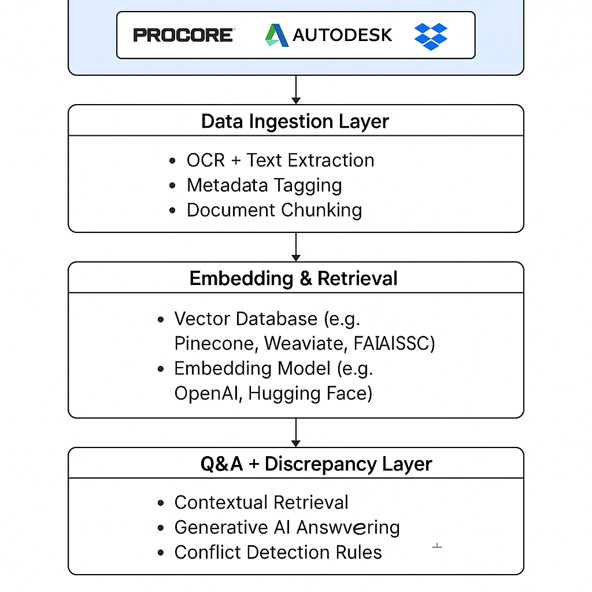
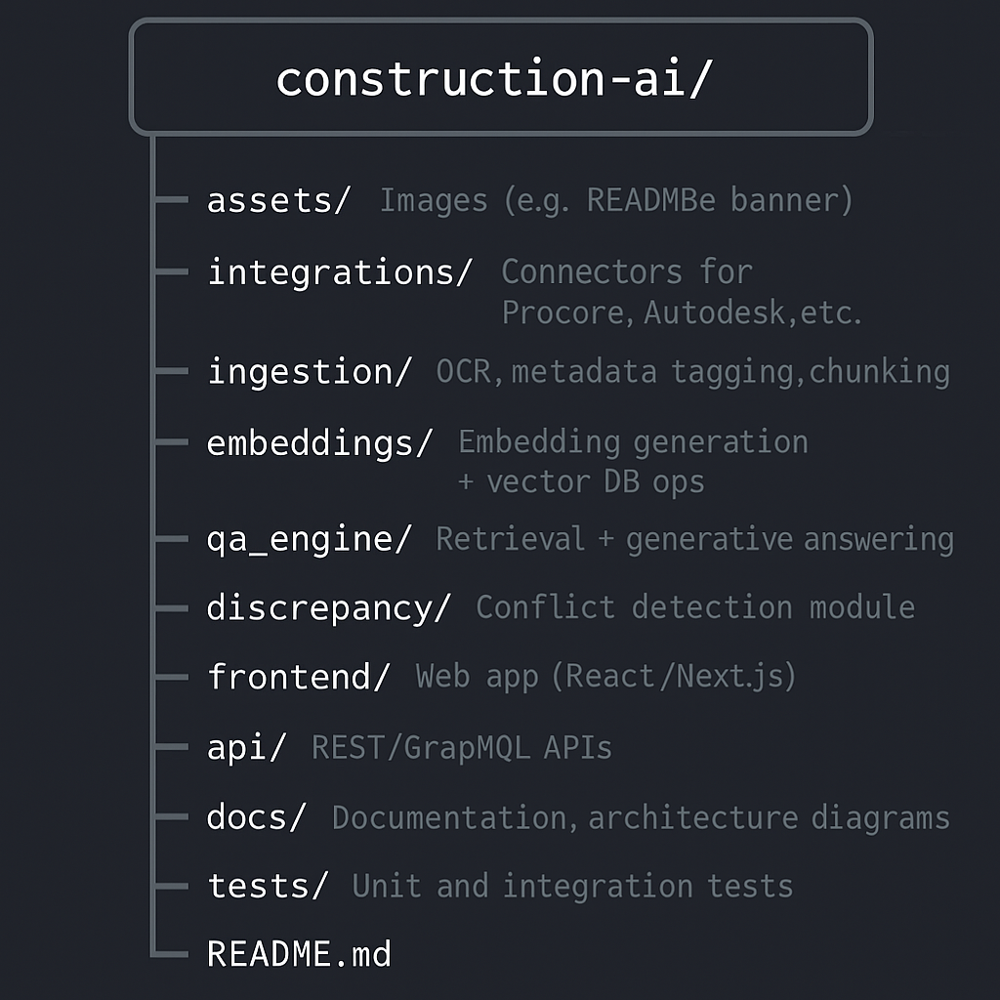

  

<h1 align="center">🏗️ Construction AI Q&A Engine</h1>

  <b>A smarter way for construction teams to find answers and avoid costly mistakes.</b>

  
  
  

---

## 🌟 Why It Matters  

Construction projects generate massive amounts of data scattered across multiple platforms. Our system transforms this complexity into a **single, intelligent knowledge hub**, enabling engineers, site managers, and executives to:  

- Ask natural language questions (e.g., “Show me all RFIs related to HVAC installation”)  
- Get cited answers from the right documents instantly  
- Detect discrepancies before they turn into costly RFIs or schedule overruns  

---

## 🚀 Vision  

We’re building toward a **next-gen construction intelligence layer**:  
- Advanced conflict detection powered by ML  
- Dashboards for project risk forecasting  
- Role-based insights for field staff, engineers, and executives  

---

# 🔧 Developer Documentation  

## Features  

- **Multi-Source Integration** → Autodesk Docs, Procore, Primavera, Dropbox  
- **Data Ingestion** → OCR, metadata tagging, chunking for efficient retrieval  
- **AI-Powered Q&A** → Context-aware natural language answers with citations  
- **Discrepancy Detection** → Automatically flags conflicts in documents and schedules  

---

## 🏗️ System Architecture  

  

⚙️ Tech Stack

Backend: Python (FastAPI/Flask), Node.js

Data Processing: PyMuPDF, Tesseract OCR, LangChain

Vector Store: Pinecone, Weaviate, or FAISS

LLM Integration: OpenAI GPT, Hugging Face models

Frontend: React/Next.js + TailwindCSS

DevOps: Docker, Kubernetes, CI/CD pipelines

## 📂 Project Structure
 

  

📊 Example Use Cases

Project Engineer: “Show me all RFIs related to HVAC installation.”

Site Manager: “What’s the discrepancy between the drawing revision and the approved submittal?”

Executive: “Summarize project risks identified in the last 2 weeks.”

🛠️ Getting Started
1. Clone the repository
git clone https://github.com/your-org/construction-ai.git
cd construction-ai

2. Set up environment
python -m venv venv
source venv/bin/activate   # (Linux/Mac)
venv\Scripts\activate      # (Windows)
pip install -r requirements.txt

3. Configure API Keys

Create a .env file with:

OPENAI_API_KEY=your_key_here
PROCORE_API_KEY=your_key_here
AUTODESK_API_KEY=your_key_here

4. Run the backend
uvicorn api.main:app --reload

5. Start the frontend
cd frontend
npm install
npm run dev

✅ Roadmap

 Add integration with Primavera

 Implement advanced discrepancy detection (ML-based)

 Role-based access control for enterprise deployments

 Dashboard with project analytics & risk forecasting

🤝 Contributing

We welcome contributions! Please fork the repo, create a feature branch, and submit a PR.

📜 License

MIT License – feel free to use and adapt this project.
